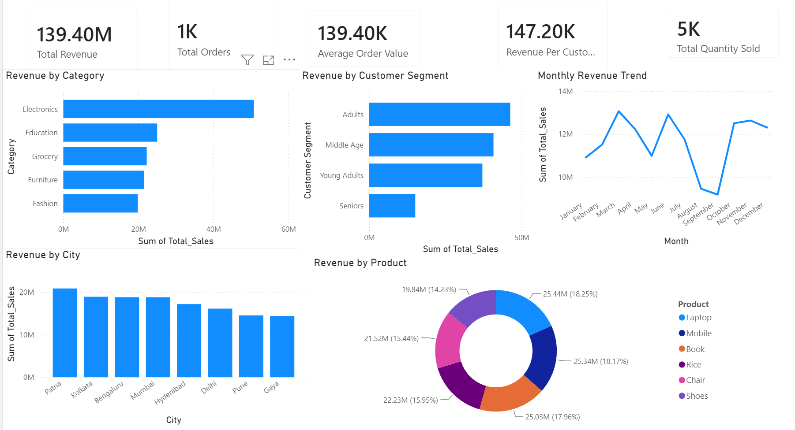

<div align="center">
  <h1>📊 Data Analytics Internship Portfolio</h1>
  <h3>ApexPlanet Software Pvt. Ltd. – 60-Day Data Analytics Internship</h3>
  <p><em>Master portfolio showcasing end-to-end data analytics, business intelligence, and data storytelling skills.</em></p>
  
  []()
  []()
  []()
  []()
  []()
  []()
</div>

---

## 📖 Project Overview
This repository serves as a comprehensive portfolio documenting the tasks and projects completed during my 60-day Data Analytics Internship at ApexPlanet Software Pvt. Ltd. It reflects a complete data journey—from data immersion and wrangling to deep-dive statistical analysis and interactive dashboarding—culminating in actionable business insights.

## 🏢 Internship Overview
- **Company:** ApexPlanet Software Pvt. Ltd.
- **Role:** Data Analytics Intern
- **Duration:** 60 Days
- **Objective:** To leverage data analysis tools and techniques to solve real-world business problems, optimize decision-making processes, and develop a comprehensive data analytics skill set.

## 🎯 Objectives
- Conduct comprehensive data cleaning, transformation, and feature engineering.
- Perform Exploratory Data Analysis (EDA) to uncover underlying data patterns.
- Design and develop interactive Power BI dashboards for business intelligence.
- Formulate and test statistical hypotheses to validate business decisions.
- Translate complex data findings into compelling business narratives.

---

## 🛠️ Technology Stack
| Category | Tools & Libraries |
| --- | --- |
| **Programming** | Python |
| **Data Manipulation** | Pandas, NumPy |
| **Data Visualization** | Matplotlib, Seaborn |
| **Database/Querying** | SQL |
| **Business Intelligence** | Power BI |
| **IDE & Version Control** | Jupyter Notebook, Git, GitHub |

---

## 📂 Folder Structure
```text
📦 Data-Analytics-Internship-Portfolio
 ┣ 📂 Task1_Data_Immersion_Wrangling
 ┣ 📂 Task2_Exploratory_Data_Analysis
 ┣ 📂 Task3_Interactive_Dashboarding
 ┣ 📂 Task4_Data_Storytelling
 ┣ 📂 Task5_Capstone_Integration
 ┗ 📜 README.md
```

---

## 📋 Task-Wise Breakdown

| Task | Description | Key Deliverables |
| :--- | :--- | :--- |
| **Task 1** | **Data Immersion & Wrangling** | Data profiling, Missing value handling, Duplicate removal, Data cleaning, Feature engineering, Data dictionary. |
| **Task 2** | **EDA & Business Intelligence** | Descriptive statistics, Univariate & Multivariate analysis, Correlation analysis, SQL questions, Dashboard mockups. |
| **Task 3** | **Deep-Dive Analysis & Dashboarding** | KPI definition, Revenue/Customer/Product analysis, Interactive Power BI dashboard, Business recommendations. |
| **Task 4** | **Data Storytelling & Statistical Validation** | Business storytelling, Hypothesis formulation, T-Test implementation, Business conclusions, Presentation development. |
| **Task 5** | **Capstone Integration & Portfolio** | Portfolio creation, GitHub documentation, Final presentation, Professional reflection. |

---

## 💡 Skills Demonstrated
<details>
<summary>Click to expand skills</summary>

- **Data Processing:** Handling missing values, outlier detection, data standardization, and feature extraction.
- **Statistical Analysis:** Hypothesis testing (T-Tests), correlation matrices, descriptive statistics.
- **Data Visualization:** Creating intuitive, stakeholder-focused charts and interactive dashboards.
- **Business Acumen:** Defining KPIs, segmenting customers, analyzing market trends, and delivering actionable recommendations.
- **Storytelling:** Communicating data-driven insights clearly to both technical and non-technical audiences.
</details>

---

## 📊 Dashboard Highlights & KPIs
### Defined KPIs:
- 💰 **Total Revenue**
- 📦 **Total Orders**
- 💳 **Average Order Value (AOV)**
- 👤 **Revenue Per Customer**
- 🛒 **Total Quantity Sold**

### 🖼️ Dashboard Screenshots


---

## 🔍 Key Business Insights
- **Top Category:** The **Electronics** category generated the highest total revenue.
- **Customer Segmentation:** The **Adults** demographic segment contributed the maximum revenue.
- **Geographic Trends:** **Patna** generated the highest city-wise revenue.
- **Product Performance:** The **Laptop** category generated the highest product-specific revenue.
- **Seasonality:** Monthly revenue trends successfully identified recurring seasonal patterns.

---

## 🎓 Learning Outcomes
- Mastered the end-to-end data analytics lifecycle.
- Gained hands-on experience in translating raw datasets into interactive BI dashboards.
- Developed proficiency in using statistical testing to validate business hypotheses.
- Enhanced communication skills by crafting data-driven stories and presentations for stakeholders.

---

## 🔗 Repository Links
- [Task 1: Data Immersion & Wrangling](./Task1_Data_Immersion_Wrangling)
- [Task 2: EDA & Business Intelligence](./Task2_Exploratory_Data_Analysis)
- [Task 3: Deep-Dive Analysis & Dashboarding](./Task3_Interactive_Dashboarding)
- [Task 4: Data Storytelling & Statistical Validation](./Task4_Data_Storytelling)
- [Task 5: Capstone Integration](./Task5_Capstone_Integration)

---

## 🚀 Future Improvements
- Integrate predictive modeling (e.g., forecasting next quarter's revenue).
- Automate the ETL pipeline using Python scripts or Apache Airflow.
- Deploy the Power BI dashboard to the web for real-time stakeholder access.
- Include more granular RFM (Recency, Frequency, Monetary) analysis.

---

## 👨‍💻 Author
**Rajan V**
*B.Tech Artificial Intelligence & Data Science Student*
*Aspiring Data Analyst | Business Intelligence Enthusiast*

---

## 🤝 Connect With Me

[](https://www.linkedin.com/in/rajanv1629/)

[](https://github.com/rajanvenkat321-sudo)

[](mailto:rajanv2907@gmail.com)

---

⭐ If you found this portfolio interesting, feel free to connect with me and explore my projects.

🚀 Always learning, building, and growing in Data Analytics, Business Intelligence, AI & Data Science.

---
<div align="center">
  <p><em>Thank you for visiting my portfolio! Feel free to reach out for collaborations or opportunities.</em></p>
</div>
