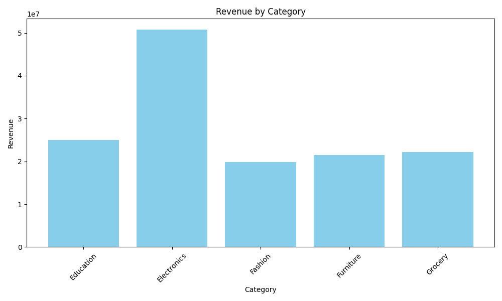
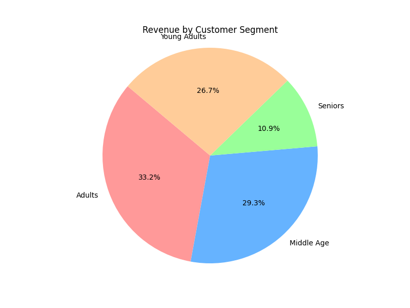
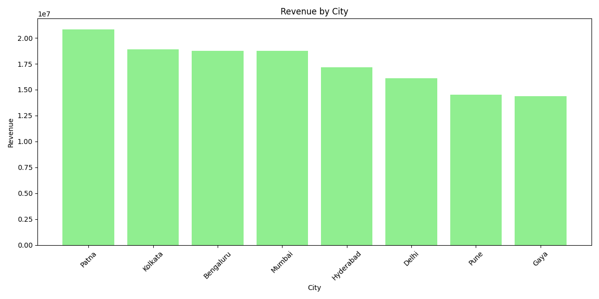
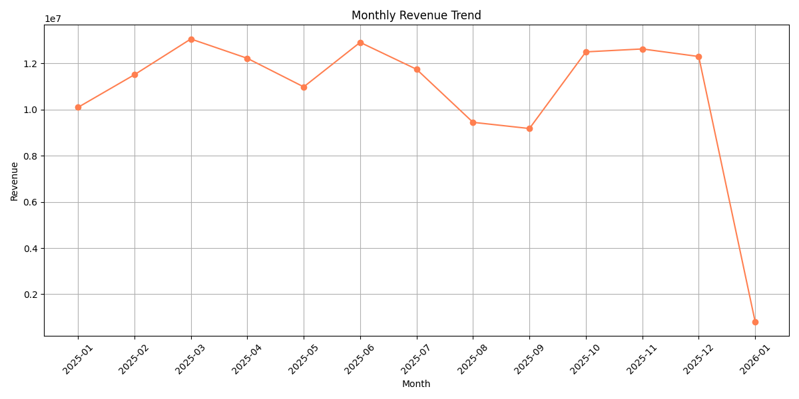

# 📊 ApexPlanet Data Analytics Internship - Task 4
**Data Storytelling & Statistical Validation**


## 📖 Overview
This repository contains the deliverables for **Task 4** of the **ApexPlanet Data Analytics Internship**. The primary focus of this project is to perform in-depth statistical analysis on a sales dataset, validate business hypotheses using descriptive statistics, construct meaningful data visualizations, and transform raw numbers into a compelling business narrative.

## 🎯 Business Objective
ApexPlanet aims to understand its sales performance and customer demographics to formulate a targeted strategy for revenue growth. This project uncovers key sales trends, identifies high-value customer segments, and evaluates the performance of different product categories and cities.

---

## 📂 Repository Structure

```text
Data-Analytics-Task4/
│
├── Statistical_Analysis.ipynb    # Python notebook with complete code and statistical calculations
├── Storytelling_Report.md        # Comprehensive business report detailing insights and recommendations
├── LinkedIn_Content.md           # Presentation script, LinkedIn post, and project summary
├── README.md                     # Project documentation (You are here)
├── requirements.txt              # Python dependencies
├── Cleaned_Sales_Dataset.csv     # The dataset utilized for analysis
└── charts/                       # Generated visualizations
    ├── revenue_by_category.png
    ├── revenue_by_city.png
    ├── revenue_by_segment.png
    └── monthly_revenue_trend.png
```

---

## 📈 Key Insights & Visualizations

### 1. Product Category Analysis
**Electronics** is the leading revenue driver, bringing in approximately **₹50.78M**. In contrast, Fashion is the lowest-performing category at **₹19.84M**.



### 2. Customer Demographics
Our most valuable customer segment is **Adults (aged 31-45)**, representing **33.2%** of total revenue. Targeted marketing efforts should focus heavily on this demographic.



### 3. Geographical Performance
**Patna** leads all other cities in sales performance, generating **₹20.8M**, while cities like Gaya present opportunities for market penetration.



### 4. Time Series Trend
We observed peak revenue in **March 2025**, but a noticeable sales dip occurred during the late summer months (August and September).



---

## 🚀 How to Run the Project

1. **Clone the repository:**
   ```bash
   git clone https://github.com/rajanvenkat321-sudo/Data-Analytics-Task4.git
   cd Data-Analytics-Task4
   ```

2. **Install the required dependencies:**
   ```bash
   pip install -r requirements.txt
   ```

3. **Explore the Analysis:**
   Open `Statistical_Analysis.ipynb` using Jupyter Notebook or JupyterLab to view the code, statistical outputs, and interactive visualizations.
   ```bash
   jupyter notebook Statistical_Analysis.ipynb
   ```

## 📬 Deliverables
* **[Statistical Analysis Notebook](Statistical_Analysis.ipynb)**
* **[Data Storytelling Report](Storytelling_Report.md)**
* **[Presentation Script & Social Media Content](LinkedIn_Content.md)**
